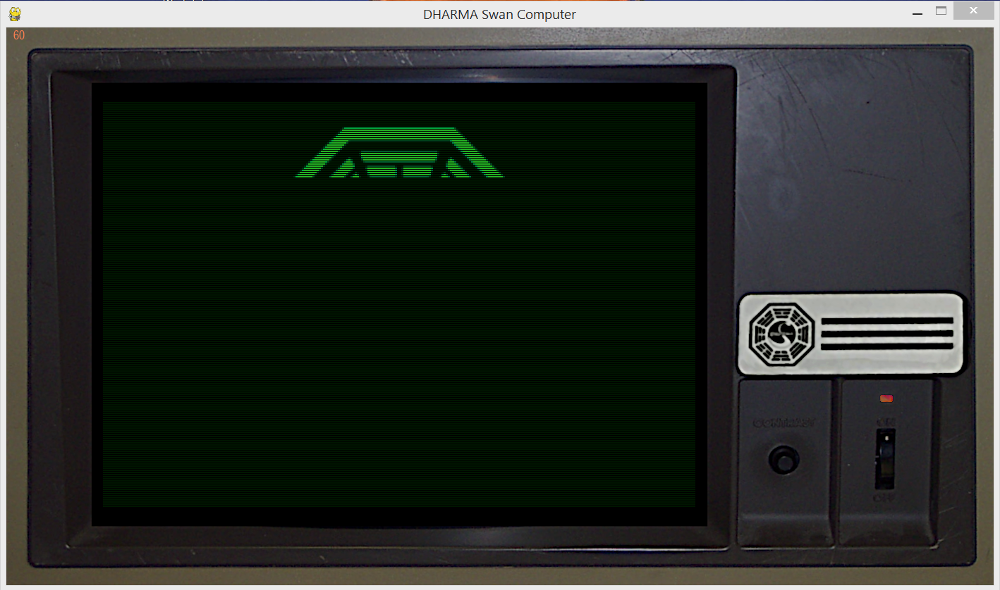

# Now it's your turn to save the world



## Usage

Clone the repo, navigate to the base folder, and execute the following in the terminal:
```
python dharma.py
```

You need Python >= 3.9 and pygame >= 2.0.1 installed (I did not test other versions).
